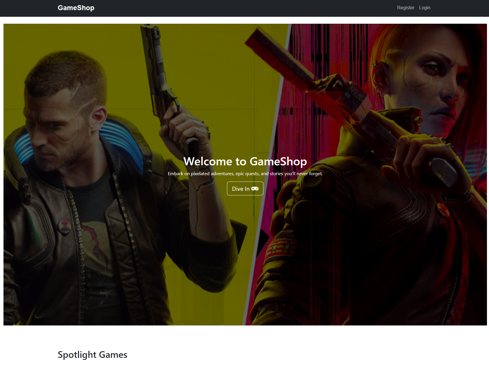
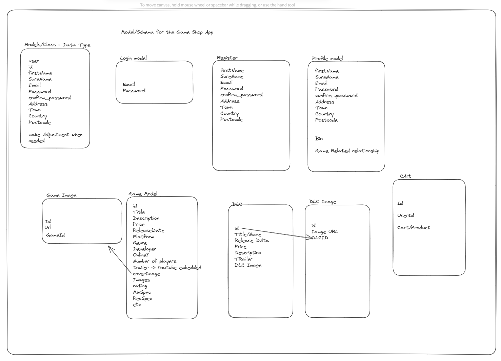
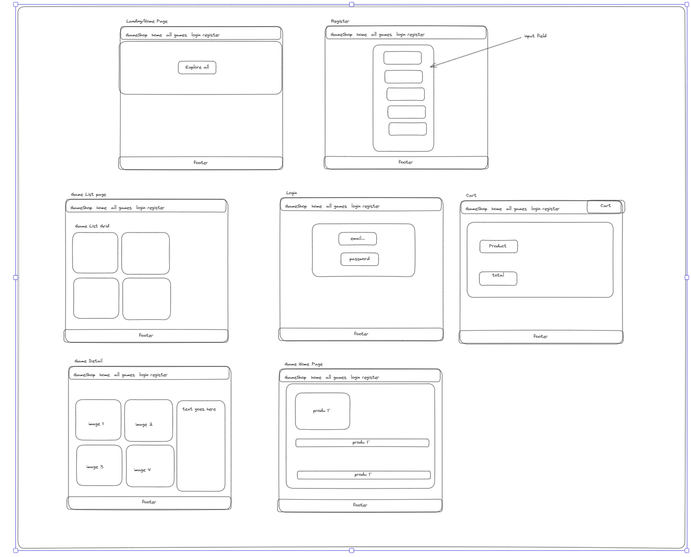
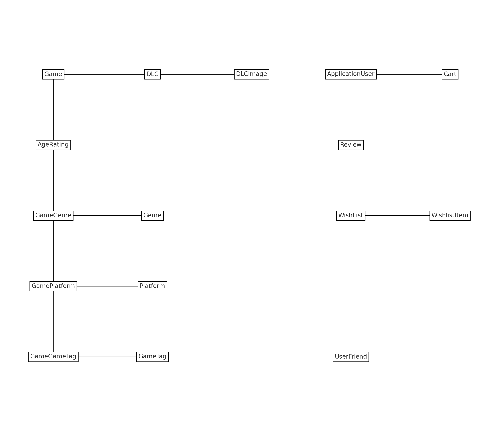
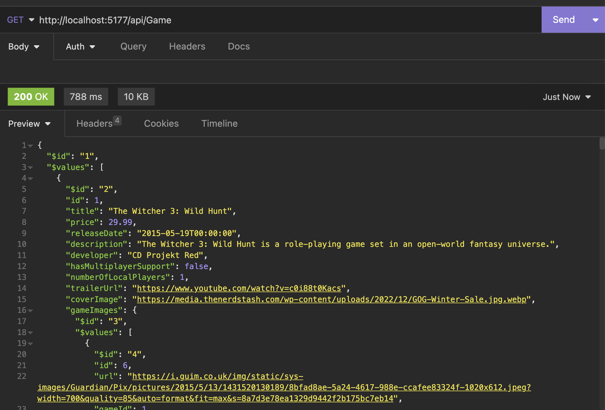

# VideoGameOnlineShop

An immersive e-commerce platform dedicated to video game enthusiasts. Crafted with precision using a blend of powerful technologies like ASP.NET, Angular, and TypeScript, and designed with sleek UI to provide an engaging user experience.




# Project Overview

VideoGameOnlineShop is a full-stack e-commerce platform where users can explore and purchase their favorite video games. With a robust backend developed using ASP.NET and C# paired with an interactive frontend crafted in Angular and TypeScript, it promises an intuitive and seamless shopping experience.

Key Features:

* JWT authentication for secure user sessions.
* Dynamic database relationships visualized with Lucid Diagram and Excalidraw.
* Responsive design optimized for various devices.

## Deployment

### 1. Environment Setup:
- Ensure [Node.js](https://nodejs.org/) is installed, as it's essential for Angular and TypeScript.
- Make sure you have the [.NET Core SDK](https://dotnet.microsoft.com/download/dotnet) to compile and run the ASP.NET Core backend.
- Install the Angular Command Line Interface:
  ```bash
  npm install -g @angular/cli
  ```

### 2. Repository Setup:
- Either clone or download the source code from the provided GitHub repository link.
- Link to GitHub repository [https://github.com/SerhanMiah/VideoGameOnlineShop]
## Deployment Steps:

### 1. Backend Preparation:
- Navigate to the directory containing the ASP.NET Core solution or project file:
  ```bash
  cd Backend
  ```
- Restore the required .NET packages:
  ```bash
  dotnet restore
  ```

### 2. Frontend Preparation:
- Switch to the Angular application directory (commonly named "Frontend"):
  ```bash
  cd FrontendOrClientAppName
  ```
- Install the required Angular dependencies:
  ```bash
  npm install
  ```
### 3. Running the Backend:
- Ensure you're in the Backend directory, then start the application:
  ```bash
  cd ../Backend
  dotnet run
  ```
- This will initialize the backend, typically accessible at https://localhost:5177.

### 4. Launching the Frontend:
- Shift to the Frontend directory:
  ```bash
  cd Frontend
  ```
- Use Angular CLI to serve the application:
  ```bash
  ng serve
  ```
- This initiates the Angular app, generally available at http://localhost:4200.

### 5. Verification:
- Open your preferred web browser and enter the provided URLs to interact with the backend services and frontend interface.

---

To see the full features for Theatre, please feel free to log in using the following credentials:

 * email: test@email.com
 * password: Password@

# The Brief

* Build a full-stack application integrating both the backend and the frontend.
* Utilize an ASP.NET Core API to interact with data from a SQL Server database.
* Use Entity Framework Core for ORM and data access.
* Consume your API with a separate frontend built with Angular and TypeScript.
* Ensure a comprehensive product, which likely entails multiple relationships and CRUD functionality for at least a couple of models/entities.
* Draft thoughtful user stories/wireframes that are detailed enough to guide you in distinguishing between core MVP features and optional enhancements.
* Deploy your application online ensuring it's publicly accessible.

## Technologies used:

### Frontend (TypeScript, Angular):
* Angular
* Tailwind
* Axios
* CSS/HTML
* TypeScript/JavaScript

### Back end:
* C#
* ASP.net
* Microsoft SQL Server Management

### Dev Tools:
* VS code
* Yarn
* Insomnia
* Git
* Github
* Google Chrome dev tools
* Trello Board (planning and timeline)
* Excalidraw (wireframing)
* Zoom
* Slack

## Phase

This project consisted of four phase

### Phase 2: Laying the Groundwork - Database Connection, Model Creation, and Migration:

In this phase, my primary focus was to lay a solid foundation for our e-commerce application's backend. Starting from establishing the database connection, sculpting the data models, to finally migrating them, this phase was all about precision and meticulous organization.







## Embracing the Power of SQL Server:

For this application's data storage, I opted for SQL Server—a reliable choice that facilitated the creation and management of our local database, laying a stable groundwork for our app data. I utilized MVC to shape the database models, which were initially structured as simple classes. Over time, these evolved, with more classes being added, often interconnected via foreign keys. I paired these classes with the ICollection method.

The principles of C# Object-Oriented Programming (OOP) played a pivotal role, especially in determining the use of public, private, and readonly accessors within the classes. Given that a significant portion was related to the gaming class, I modularized some classes into smaller sections for better manageability and potential reuse. After setting up the classes, I integrated the local database with the backend.

SQL Server was chosen not only for its stability but also for its flexibility in supporting robust connections to cloud databases like Azure, AWS, and more. This project became an enriching learning curve, especially as my prior experience was mainly with Table Plus and MySQL for local databases.

## NuGet Packages and JWT:

To supercharge the backend, I harnessed the incredible capabilities of NuGet packages. These packages became our tools, empowering us to streamline tasks, enhance security, and accelerate development. Among them, JWT (JSON Web Tokens) stood out as our trusty guardian, ensuring the utmost security for user authentication. I used Enitity and Identify nuget packages to connect the local host default connection and use Identify for the application user which is an inbuilt into the entitiy framework.


### Phase 2 Designing the Database and Crafting Models:

**Database Design with MS SQL Server Management**: Given the intricate data relationships in our app—spanning from video games to user reviews—we needed a robust database system. SQL Server Management was chosen for this task. I created well-structured tables to avoid data redundancy and maintain easy-to-understand relationships, both simple and complex.

## Connection Configuration


To kick things off, I set up the connection between our application and the database.
First, set your connection string in the `appsettings.json`:

```json
{
  "ConnectionStrings": {
    "DefaultConnection": "Connection String goes here"
  }
}
```
And then linked it to the DbContext using:

```csharp
builder.Services.AddDbContext<GameDbContext>(options => 
    options.UseSqlServer(configuration.GetConnectionString("DefaultConnection")));
```

After establishing the connection, I successfully migrated the database to a server using the `dotnet ef database update` command. However, before doing so, I had to define the models and set up the framework. This provided a reference point for the database on my local machine.

**Building Models with C# ASP.NET Entity Framework**:

Once connected, I embarked on crafting models that would define and structure our data.

- **Entity Creation**: For each database table, I created a corresponding model in C#.

* Game Model: This model was pivotal as it encapsulated the core attributes of a game, including its basic properties, media attributes, ratings, and intricate relationships with other entities.

Game Model: 
```csharp
    public class Game
    {
        // =====================
        // Basic Properties
        // =====================
        
        [Key]
        public int Id { get; set; }

        [Required, StringLength(100), Display(Name = "Title")]
        public string? Title { get; set; }

        [Required, Column(TypeName = "decimal(18, 2)"), Display(Name = "Price")]
        public decimal Price { get; set; }

        [Required, DataType(DataType.Date), Display(Name = "Release Date")]
        public DateTime ReleaseDate { get; set; }

        [StringLength(500), Display(Name = "Description")]
        public string? Description { get; set; }

        // =====================
        // Game Details
        // =====================

        [StringLength(255), Display(Name = "Developer")]
        public string? Developer { get; set; }

        [StringLength(255), Display(Name = "Publisher")]
        public string? Publisher { get; set; }

        [Display(Name = "Multiplayer Support")]
        public bool HasMultiplayerSupport { get; set; }

        [Display(Name = "Number of Local Players")]
        public int NumberOfLocalPlayers { get; set; }

        // =====================
        // Media Properties
        // =====================

        [DataType(DataType.Url), Display(Name = "Trailer URL")]
        public string? TrailerUrl { get; set; }

        public string? CoverImage { get; set; }  // Cover Image field

        public ICollection<GameImage>? GameImages { get; set; }

        // =====================
        // Ratings & Requirements
        // =====================

        [Display(Name = "Average Rating")]
        public double? AverageRating { get; set; }

        [Display(Name = "ESRB Content Descriptions")]
        public string? ESRBContentDescriptions { get; set; }

        [Display(Name = "Minimum System Requirements")]
        public string? MinimumSystemRequirements { get; set; }

        [Display(Name = "Recommended System Requirements")]
        public string? RecommendedSystemRequirements { get; set; }

        [Column(TypeName = "decimal(18, 2)"), Display(Name = "Discounted Price")]
        public decimal? DiscountedPrice { get; set; }

        // =====================
        // Relationships
        // =====================

        public virtual ICollection<GameGenre> GameGenres { get; set; } = new List<GameGenre>();
        public virtual ICollection<GamePlatform> GamePlatforms { get; set; } = new List<GamePlatform>();
        public ICollection<DLC> DLCs { get; set; } = new List<DLC>();
        public virtual ICollection<Language> SupportedLanguages { get; set; } = new List<Language>();

        public virtual ICollection<GameGameTag> GameGameTags { get; set; } = new List<GameGameTag>();

        public virtual ICollection<Review> Reviews { get; set; } = new List<Review>();


        public int AgeRatingId { get; set; }
        [ForeignKey("AgeRatingId")]
        [Display(Name = "Age Rating")]
        public virtual AgeRating? AgeRating { get; set; }

        public virtual ICollection<OrderItem>? OrderItems { get; set; }

        // =====================
        // Timestamps
        // =====================

        public DateTime CreatedAt { get; set; } = DateTime.UtcNow;
        public DateTime UpdatedAt { get; set; } = DateTime.UtcNow;
    }
```

IdentityUser - ApplicationUser Model:
IdentityUser - ApplicationUser Model: To manage user-related data, I utilized the power of the ASP.NET Identity framework and extended the default IdentityUser class to create a more tailored ApplicationUser model for our app.

```csharp
    public class ApplicationUser : IdentityUser
    {
        [StringLength(50)]
        public string? FirstName { get; set; }

        [StringLength(50)]
        public string? LastName { get; set; }

        [StringLength(100)]
        public string? Address { get; set; } = string.Empty;

        [StringLength(50)]
        public string? City { get; set; }

        [StringLength(50)]
        public string? State { get; set; }

        [StringLength(10)]
        public string? PostalCode { get; set; }

        [StringLength(50)]
        public string? Country { get; set; }

        public virtual Cart? Cart { get; set; }

        public virtual ICollection<Order>? Orders { get; set; }

        public virtual ICollection<Review>? Reviews { get; set; }

        public virtual ICollection<WishList>? WishLists { get; set; }

        public string? FavoriteGame { get; set; }

        public int TotalGamesPlayed { get; set; }

        [NotMapped]
        public ICollection<string> Achievements { get; set; } = new List<string>();

        public string AchievementsDb
        {
            get { return Achievements != null ? string.Join(",", Achievements) : ""; }
            set { Achievements = value?.Split(',').ToList() ?? new List<string>(); }
        }

        public ICollection<Game> GameLibrary { get; set; } = new List<Game>();

        public virtual ICollection<UserFriend> UserFriends { get; set; } = new List<UserFriend>();

        public string? Bio { get; set; }

        public int? DefaultBillingId { get; set; }
        [ForeignKey("DefaultBillingId")]
        public virtual Billing? DefaultBillingDetails { get; set; }

    }
}

```
  


## GameDbContext
- **DBContext**: This serves as the liaison between our app and the database, ensuring smooth data operations.
The heart of our backend, GameDbContext, was then defined. Acting as the intermediary between our application and the database, this context was essential for smooth data operations.

The `GameDbContext` class extends `IdentityDbContext<ApplicationUser>` and is responsible for initializing and managing the database context for our game application.

Here's a look at the class definition:

```csharp
public class GameDbContext : IdentityDbContext<ApplicationUser>
{
    private readonly IPasswordHasher<ApplicationUser> _passwordHasher;

    public GameDbContext(DbContextOptions<GameDbContext> options, IPasswordHasher<ApplicationUser> passwordHasher)
        : base(options)
    {
        _passwordHasher = passwordHasher;
    }

    public DbSet<Game> Games { get; set; }
    public DbSet<GameImage> GameImages { get; set; }
    public DbSet<Order> Orders { get; set; }
    public DbSet<OrderItem> OrderItems { get; set; }
    public DbSet<Cart> Carts { get; set; }
    public DbSet<CartItem> CartItems { get; set; }
}
```

GameDbContext inherits from IdentityDbContext<ApplicationUser> to leverage the ASP.NET Core Identity framework for user authentication and management.
An instance of IPasswordHasher<ApplicationUser> is injected into the constructor to manage password hashing for our ApplicationUser.

The DbSet<TEntity> represents a collection of entities in the context that can be queried from the database. In the context of Entity Framework (EF), creates the tables in the database.

- **LINQ for Data Operations**: Leveraging LINQ with Entity Framework, I further streamlined database operations, making it intuitive to establish relationships between models and enhance our application with rich features.

For instance, in one of my controllers:

Consider this example from my game controller:

```csharp

        // GET: api/game
        [HttpGet]
        public ActionResult<IEnumerable<Game>> GetGamesWithImagesAndDLCs()
        {
            var gamesWithImagesAndDLCs = _dbContext.Games
                .Include(g => g.GameImages)
                .Include(g => g.DLCs)
                .ThenInclude(d => d.DLCImages!)
                .ToList();

            return gamesWithImagesAndDLCs;
        }
```
In this example, I utilized LINQ queries to effortlessly establish relationships between different models and enrich the application with advanced features. The query retrieves all games along with their related images and DLCs, showcasing the power and simplicity of combining LINQ with Entity Framework.
---

**Controller Development and Initial Tests**: Grounded in my preliminary designs, I embarked on constructing controllers tailored to address web requests. My starting point revolved around formulating GET requests. This soon expanded to crafting unique endpoints that catered to all conceivable game-related functionalities, including the full spectrum of CRUD operations. 

**Migration and Data Seeding**: With the establishment of models and the necessary foundational groundwork, the next step was to migrate our database structure to the server. Utilizing the `dotnet ef add migration InitialCreate` & `dotnet ef database update` command, I seamlessly transitioned the database. However, the ultimate testament to the backend's efficacy was its performance under practical scenarios. To emulate a real-world setting, I populated the database with test data, ensuring a flawless interaction and operation.

**Comprehensive Testing**: After setting the stage with controllers, I proceeded with comprehensive testing using platforms such as Swagger and Insomnia. My journey began with simple GET requests, gradually ramping up in complexity and breadth. Tools like Insomnia were pivotal in this phase, facilitating validation and ensuring our endpoints responded as intended.

--- 
```csharp

        // GET: api/game
        [HttpGet]
        public ActionResult<IEnumerable<Game>> GetGamesWithImagesAndDLCs()
        {
            var gamesWithImagesAndDLCs = _dbContext.Games
                .Include(g => g.GameImages)
                .Include(g => g.DLCs)
                .ThenInclude(d => d.DLCImages!)
                .ToList();

            return gamesWithImagesAndDLCs;
        }
```

HttpGet request to fetch the game data from the localhost shown below

Insomia GET Test: 



**Testing with Seeding Data**: To ensure the app's optimal performance, I populated our database with test data. I believe a solid backend sets the stage for an impeccable frontend experience, especially when performing real-world data operations. Starting with a small data set I created necessary seeding data for games and all the relationship for Game, these include: Genre, Rating, DLC, GameImages. I adopted more enum as games would have several genres or rating, rather writing these again and again using enum provided a solid solution for multiple choices. 

```csharp
            // Games
            var games = new List<Game>
            {
                new Game
                {
                    Id = 1,
                    Title = "The Witcher 3: Wild Hunt",
                    Price = 29.99m,
                    ReleaseDate = new DateTime(2015, 5, 19),
                    Description = "The Witcher 3: Wild Hunt is a role-playing game set in an open-world fantasy universe.",
                    TrailerUrl = "https://www.youtube.com/watch?v=c0i88t0Kacs",
                    Developer = "CD Projekt Red",
                    AverageRating = 4.8,
                    MinimumSystemRequirements = "OS: Windows 7 or 8 (64-bit), Processor: Intel Core i5-2500K 3.3 GHz or AMD Phenom II X4 940, Memory: 6 GB RAM, Graphics: NVIDIA GeForce GTX 660 or AMD Radeon HD 7870, Storage: 35 GB available space",
                    RecommendedSystemRequirements = "OS: Windows 7 or 8 (64-bit), Processor: Intel Core i7-3770 3.4 GHz or AMD FX-8350 4 GHz, Memory: 8 GB RAM, Graphics: NVIDIA GeForce GTX 770 or AMD Radeon R9 290, Storage: 35 GB available space",
                    HasMultiplayerSupport = false,
                    NumberOfLocalPlayers = 1,
                    DiscountedPrice = null,
                    AgeRatingId = 2,
                    CoverImage = "https://media.thenerdstash.com/wp-content/uploads/2022/12/GOG-Winter-Sale.jpg.webp"
                },
                    new Game
                {
                    Id = 2,
                    Title = "Red Dead Redemption 2",
                    Price = 49.99m,
                    ReleaseDate = new DateTime(2018, 10, 26),
                    Description = "Red Dead Redemption 2 is an action-adventure game set in the Wild West.",
                    TrailerUrl = "https://www.youtube.com/watch?v=eaW0tYpxyp0",
                    Developer = "Rockstar Games",
                    AverageRating = 4.9,
                    MinimumSystemRequirements = "OS: Windows 7 (64-bit), Processor: Intel Core i5-2500K, Memory: 8 GB RAM, Graphics: NVIDIA GeForce GTX 770, Storage: 150 GB available space",
                    RecommendedSystemRequirements = "OS: Windows 10 (64-bit), Processor: Intel Core i7-4770K, Memory: 12 GB RAM, Graphics: NVIDIA GeForce GTX 1060, Storage: 150 GB available space",
                    HasMultiplayerSupport = true,
                    NumberOfLocalPlayers = 1,
                    DiscountedPrice = null,
                    AgeRatingId = 2,
                    CoverImage = "https://www.rockstargames.com/reddeadredemption2/rockstar_games/r_d_r_logo.jpg"
                },
                new Game
                {
                    Id = 3,
                    Title = "Cyberpunk 2077",
                    Price = 59.99m,
                    ReleaseDate = new DateTime(2020, 12, 10),
                    Description = "Cyberpunk 2077 is a role-playing video game developed and published by CD Projekt.",
                    TrailerUrl = "https://www.youtube.com/watch?v=vjF9GgrY9c0",
                    Developer = "CD Projekt Red",
                    AverageRating = 4.0,
                    MinimumSystemRequirements = "OS: Windows 7 (64-bit), Processor: Intel Core i5-3570K, Memory: 8 GB RAM, Graphics: NVIDIA GeForce GTX 780, Storage: 70 GB available space",
                    RecommendedSystemRequirements = "OS: Windows 10 (64-bit), Processor: Intel Core i7-4790, Memory: 16 GB RAM, Graphics: NVIDIA GeForce GTX 1060, Storage: 70 GB available space",
                    HasMultiplayerSupport = false,
                    NumberOfLocalPlayers = 1,
                    DiscountedPrice = null,
                    AgeRatingId = 2,
                    CoverImage = "https://www.cyberpunk.net/build/images/home/title-c-logo-8d1c4e3341.svg"
                },
              // add more games.


```

---

**Middleware & Tools**: Proper middleware integration was essential for CORS support, ensuring smooth communication across various sources. I extensively used Swagger for API testing, complemented by Insomnia for data exchange verification.

---

### Key Learnings from Phase 2:
Database Design: A well-laid-out schema not only simplifies current operations but also future-proofs the application. Visual tools like EDR Flowcharts and Excalidraw sketches were instrumental in helping me visualize and finalize the relationships between models.

Entity Framework and LINQ: These tools, while incredibly powerful, also come with their intricacies. It's crucial to understand their nuances to harness their potential fully without affecting performance.

The Importance of Testing: Regular testing, both with seeded data and tools, is non-negotiable. It highlights potential bottlenecks and ensures the robustness of the backend.

This phase, though rigorous, has set a sturdy foundation for our application. With the core structures in place, I'm now geared up for the upcoming challenges and intricacies of our Video Game Management System.


### Phase 3: Bridging Backend with Frontend:

In this phase, I integrated our backend services with the frontend interface. I employed Angular—a component-based framework—to ensure seamless communication with our ASP.NET backend.

**Seeding & Initial Tests**: I initiated the process by populating our system with test data derived from the video game models and their associated relationships. Using tools like Insomnia, I verified if the application correctly accessed information via designated endpoints and HTTP requests.

**API Development**: Using ASP.NET, I developed RESTful APIs to bridge the gap between our frontend and backend. This included endpoints for every video game function, user interactions, and specific features like user login, registration, profile management, and JWT token generation for user authentication.

**Endpoint Organization**: I structured our endpoints within the Controller section, categorizing them to maintain clarity. Developing the Auth controller posed some challenges, particularly in integrating JWT tokens for authentication.

**Validation and Testing**: With Swagger, I validated data retrieval in JSON format. Additionally, I used bearer tokens in Insomnia and console logs to check user authentication. To enhance user feedback and provide a dynamic user experience, I integrated toaster notifications.

---

### Phase 4 Styling the Frontend

Over the past few days, I have poured my creative energy into designing a website that truly reflects my personal style. By leveraging the powerful combination of Bootstrap, Tailwind, CSS and SASS, I was able to add a level of sophistication and polish to the site's design that truly sets it apart.

In addition to aesthetics, I also devoted time to optimizing the site for mobile devices through code refactoring and implementation of CSS media.
These enhancements have truly elevated the site's functionality and aesthetics to new heights, making it a truly immersive and engaging experience for all who visit.


## Deployment 

During the deployment phase of our website, I encountered challenges with Azure App Service, particularly when trying to host the database. Furthermore, transitioning the website to use the production-based API URL via the environment configuration presented issues. To navigate around these obstacles, I turned to Heroku as an alternative hosting solution. Once the build was successfully deployed on Heroku, I made necessary modifications to the firewall settings, ensuring that the appropriate IP addresses were whitelisted, thus securing a seamless operational flow for the website.

## Final Product 


## Wins & Challenges

### Win
* Successful Integration: Bringing together a C# backend and an Angular frontend was no small feat. However, my meticulous planning and design made integration smoother than anticipated.
* Updating the Cart when a registered user is logged in and hits the buy button in the game detail component page.
* Having a greater understanding on how OOP works and how it is used both in the frontend and backend. 


### Challenges
* TypeScript Learning Curve: Transitioning from JS to TS presented initial hurdles, especially around strict typing and interfaces.
* Learning TS and Angular while making this application was incredibly changling. From more experience developers I was told not to use any, however in certain situation this became impossible for my skillset and looking develop my skills futher using TS for future projects


### Bugs
*  TypeScript Learning Curve: Transitioning from JS to TS presented initial hurdles, especially around strict typing and interfaces.

*  Debugging Cross-Platform Issues: As with any full-stack development, ensuring seamless interaction between different technologies had its moments of head-scratching.


## Future Content and Improvements:

* Authentication Flow: Initial iterations had some bugs around the JWT authentication flow, which were subsequently ironed out.
* Using Swipe and other payment API method for the application. 


## Key learnings

* Coming from a JavaScript background, TypeScript's nuances were both challenging and enlightening. Static typing, although initially restrictive, proved invaluable in catching errors early. Angular's component-based architecture presented a paradigm shift but enabled more organized and modular code.


Embracing continuous learning was pivotal. Every challenge faced was an opportunity to delve deeper into the technology stack and emerge with a clearer understanding. Iterative development, feedback, and a focus on the user experience were crucial to the project's success.


[def]: ./frontend/src/screenshots/GameLayoutFront.png